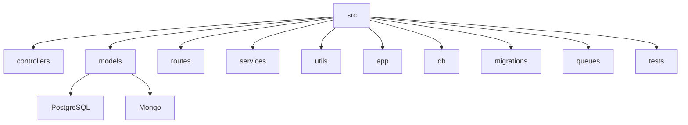

# Node.js Backend API
================================

## 🗂️  Description

This project is a Node.js backend API designed to manage a shop's operations, including product management, cart management, order management, and task management. The API provides a robust and scalable solution for handling various business logic and interactions with the database.

The API is built using Express.js, PostgreSQL, and MongoDB, with a focus on security, authentication, and authorization. It includes features such as role-based access control, JSON Web Token (JWT) authentication, and logging.

## ✨ Key Features

### **Product Management**

*   Retrieve products
*   Manage product details

### **Cart Management**

*   Add items to cart
*   Retrieve cart contents
*   Manage cart operations

### **Order Management**

*   Create orders
*   Retrieve order details
*   Manage order operations

### **Task Management**

*   Create tasks
*   Retrieve tasks
*   Update task status
*   Delete tasks

### **Authentication and Authorization**

*   JSON Web Token (JWT) authentication
*   Role-based access control (RBAC)

## 🗂️ Folder Structure



## 🛠️ Tech Stack


## ⚙️ Setup Instructions

### Prerequisites

*   Node.js (version 16 or higher)
*   PostgreSQL (version 13 or higher)
*   MongoDB (version 5 or higher)
*   Docker (optional)

### Installation

1.  Clone the repository:

    ```bash
git clone https://github.com/DinarMin/Backend-API-nodeJs.git
```
2.  Install dependencies:

    ```bash
cd Backend-API-nodeJs
npm install
```
3.  Create a `.env` file and add environment variables:

    ```makefile
DB_HOST=localhost
DB_PORT=5432
DB_USERNAME=postgres
DB_PASSWORD=postgres
DB_NAME=shop
```
4.  Run migrations:

    ```bash
npm run migrate
```
5.  Start the server:

    ```bash
npm start
```

## 📝 API Endpoints

The API provides various endpoints for managing products, carts, orders, and tasks. Please refer to the [API documentation](https://example.com/api-docs) for a comprehensive list of endpoints and their usage.

## 🤖 GitHub Actions

This repository uses GitHub Actions for continuous integration and deployment. The workflow is defined in the `.github/workflows/main.yml` file and includes the following steps:

*   Build and test the application
*   Deploy to a production environment

## 📊 Testing

The project includes tests for various components, including API endpoints, services, and controllers. You can run tests using the following command:

```bash
npm test
```


<br><br>
<div align="center">

<h3>Dinar</h3>
<p>Backend developer with expertise in Node.js.</p>
</div>
<br>
<p align="right">
  <a href="https://gitfull.vercel.app">Made by GitFull</a>
</p>
    